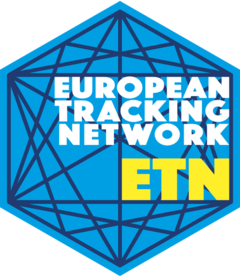

<!-- README.md is generated from README.Rmd. Please edit that file -->

```{r, include = FALSE}
knitr::opts_chunk$set(
  collapse = TRUE,
  comment = "#>",
  fig.path = "man/figures/README-",
  out.width = "100%"
)
```

# etn 

<!-- badges: start -->
[](https://CRAN.R-project.org/package=etn)
[](https://www.repostatus.org/#active)
<!-- badges: end -->

Etn provides functionality to access data from the [European Tracking Network (ETN)](http://www.lifewatch.be/etn/) database hosted by the Flanders Marine Institute (VLIZ) as part of the Flemish contribution to LifeWatch. ETN data is subject to the [ETN data policy](http://www.lifewatch.be/etn/assets/docs/ETN-DataPolicy.pdf) and can be:
 
- restricted: under moratorium and only accessible to logged-in data owners/collaborators
- unrestricted: publicly accessible without login and routinely published to international biodiversity facilities
 
The ETN infrastructure currently requires the package to be run within the [LifeWatch.be RStudio server](http://rstudio.lifewatch.be/), which is password protected. A login can be requested at http://www.lifewatch.be/etn/contact.

## Installation

You can install the development version of etn from [GitHub](https://github.com/) with:

``` r
# install.packages("devtools")
devtools::install_github("inbo/etn")
```

## Meta

- We welcome [contributions](.github/CONTRIBUTING.md) including bug reports.
- License: MIT
- Get citation information for etn in R doing `citation("etn")`.
- Please note that this project is released with a [Contributor Code of Conduct](.github/CODE_OF_CONDUCT.md). By participating in this project you agree to abide by its terms.
