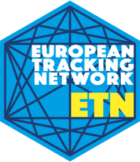

<!-- README.md is generated from README.Rmd. Please edit that file -->

```{r, include = FALSE}
knitr::opts_chunk$set(
  collapse = TRUE,
  comment = "#>",
  fig.path = "man/figures/README-",
  out.width = "100%"
)
```

# etn 

<!-- badges: start -->
[](https://CRAN.R-project.org/package=etn)
[](https://inbo.r-universe.dev/etn)
[](https://github.com/inbo/etn/actions/workflows/R-CMD-check.yaml)
[](https://app.codecov.io/gh/inbo/etn)
[](https://www.repostatus.org/#active)
[](https://doi.org/10.5281/zenodo.15235747)
<!-- badges: end -->

etn is an R package to access data from the [European Tracking Network (ETN)](https://www.lifewatch.be/etn/). With etn you can query metadata (animals, tags, deployments, receivers, projects) and data (acoustic detections, sensor data) from the ETN database and use these in your analyses. Data access requires user credentials and is subject to a [data policy](https://europeantrackingnetwork.org/en/4-data-policy-permissions-citation-guidelines-and-data-use).

To get started, see:

- [Configure credentials](https://inbo.github.io/etn/articles/authentication.html).
- [Function reference](https://inbo.github.io/etn/reference/index.html): overview of all functions.
- [Explore acoustic telemetry data](https://inbo.github.io/etn/articles/acoustic_telemetry.html).

## Installation

You can install the development version of etn from [GitHub](https://github.com/) with:

``` r
# install.packages("pak")
pak::pak("inbo/etn")
```

## Usage


Before you can access data from the European Tracking Network, you need to request a login from the Flanders Marine Institute (VLIZ). A detailed description on how to do this can be found in the vignette on [authentication](articles/authentication.html#dont-have-an-account-to-etn). 

This is a basic example which shows you how to solve a common problem:

```{r example}
library(etn)
# Get data for animal with animal_id 740
get_animals(animal_id = 740) |> dplyr::glimpse()
# Get detections for the associated tag for a certain period
get_acoustic_detections(tag_serial_number = "1097352",
                        start_date = "2011-01-01",
                        end_date = "2011-01-15")
```

## Meta

- We welcome [contributions](.github/CONTRIBUTING.md) including bug reports.
- License: MIT
- Get citation information for etn in R doing `citation("etn")`.
- Please note that this project is released with a [Contributor Code of Conduct](.github/CODE_OF_CONDUCT.md). By participating in this project you agree to abide by its terms.
